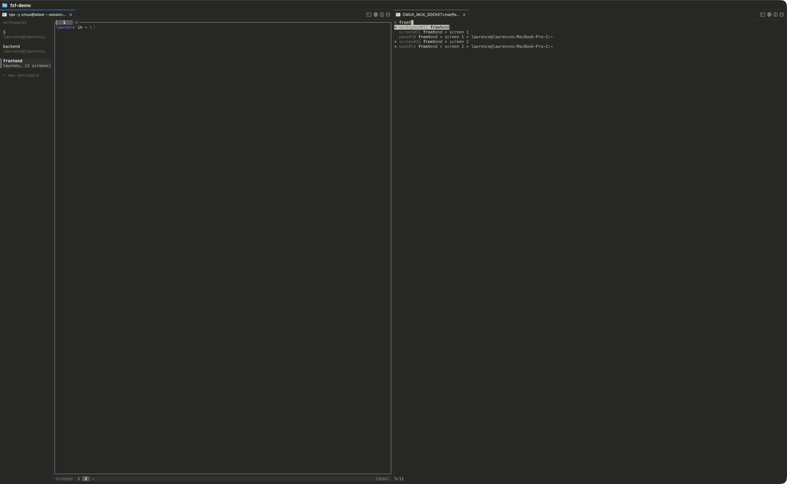

# cmux-sidebar-fzf



`cmux-sidebar-fzf` is the reference sidebar plugin for the cmux terminal multiplexer. It is an ordinary terminal program that renders an fzf-style fuzzy finder over the current cmux session tree, including workspaces, screens, and panes.

## Sidebar Plugin Contract

A cmux sidebar plugin is an ordinary terminal (TUI) program. cmux runs it inside a PTY sized to the sidebar rectangle and renders its output in the sidebar; when the user focuses the sidebar, keystrokes go to the plugin verbatim. cmux's global prefix chord is the escape hatch back to cmux.

cmux exposes its control socket to the plugin with the `CMUX_TUI_SOCKET` environment variable (legacy name `CMUX_MUX_SOCKET` is still set and accepted). The value is the path to the JSON-lines control socket. The variable is present when launched by cmux, and can also be set manually for standalone development.

Terminal size comes from the PTY through normal terminal sizing and `SIGWINCH`; sidebar plugins do not need a special resize protocol.

Plugins act on cmux through the mux control socket. This plugin uses the Rust `cmux-client` crate to call `identify`, `list_workspaces`, `select_workspace`, `select_screen`, and `focus_pane`.

Plugins should not exit on `Esc`; cmux owns the focus escape chord. In this plugin, `Esc` clears the query and `Ctrl-C` exits cleanly.

## Features

- Fuzzy subsequence matching over breadcrumb labels like `workspace > screen > pane`.
- Workspace, screen, and pane rows with kind and id.
- Bold match positions, highlighted selection, and a filtered count line.
- Middle truncation for narrow sidebars.
- Tree refresh after activation and every two seconds while idle.
- Reconnect screen with backoff if the socket is unavailable or drops.

## Standalone Development

Run cmux, find the mux socket path, and pass it to the plugin:

```sh
CMUX_TUI_SOCKET=/path/to/cmux-tui.sock cargo run
```

If your cmux build can print its socket path, a typical workflow is:

```sh
CMUX_TUI_SOCKET=$(cmux-tui ... print socket path) cargo run
```

For quick discovery on a local machine, socket paths often look like:

```sh
ls /tmp/cmux-tui-*.sock
```

Running without a socket env var is supported and renders a helpful reconnect screen instead of panicking.

## Install With cmux

Plugin installation requires cmux >= the version that ships plugin support.

```sh
cmux-tui plugin install https://github.com/manaflow-ai/cmux-sidebar-fzf
```

The host-side plugin installer command ships separately from this reference plugin.

## Build

```sh
cargo build --release
```

The plugin manifest is `cmux-plugin.toml`:

```toml
[plugin]
name = "fzf"
kind = "sidebar"
version = "0.1.0"
description = "Fuzzy-find workspaces, screens, and panes"

[run]
command = ["target/release/cmux-sidebar-fzf"]

[build]
command = ["cargo", "build", "--release"]
```

## Test

```sh
cargo fmt --check
cargo clippy --all-targets -- -D warnings
cargo test
cargo build --release
```
